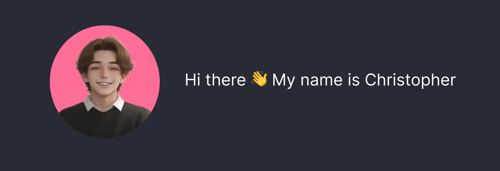

<br>

```python
>print("Hello World")
```

<pre align="center">
Welcome to my github profile
</pre>
<br>
<table align="center" >
  <tr>
    <td>
      
    </td>
    <td>
      
    </td>
  </tr>
</table>

<p align="center">

</p>

<!-- # test test
aaaa
## test test -->
<h2 >Technologies I've worked with:</h2>
<div >


</div>

### Contact:

[](mailto:krzysztof.kuciel1@gmail.com)
